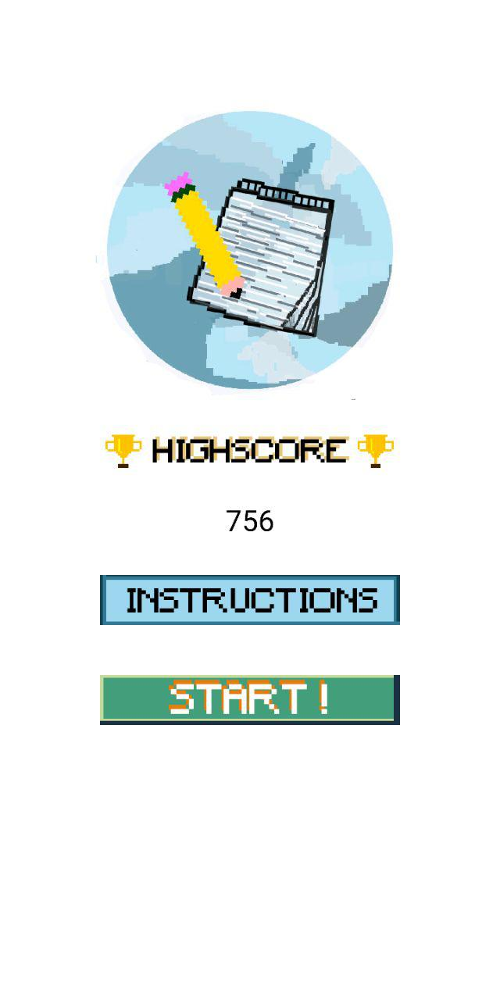
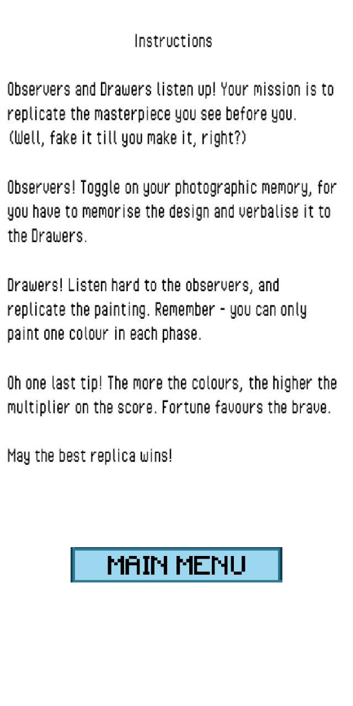
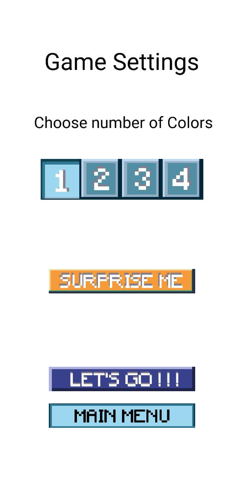
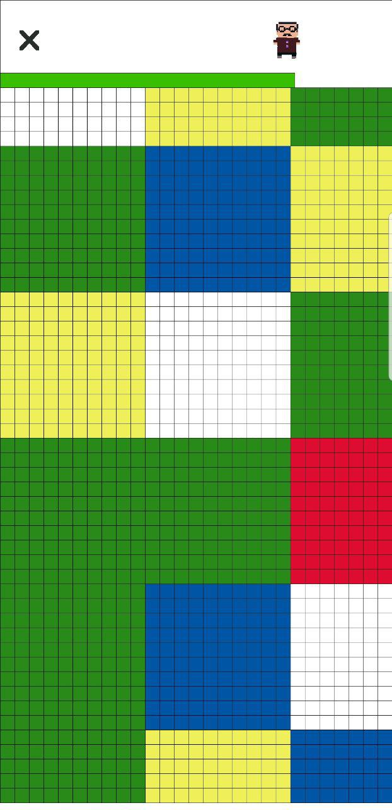
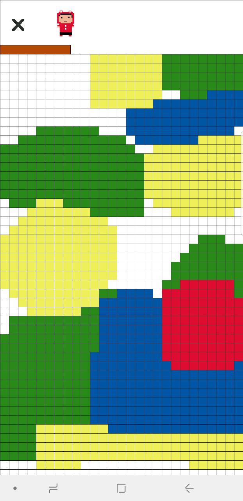
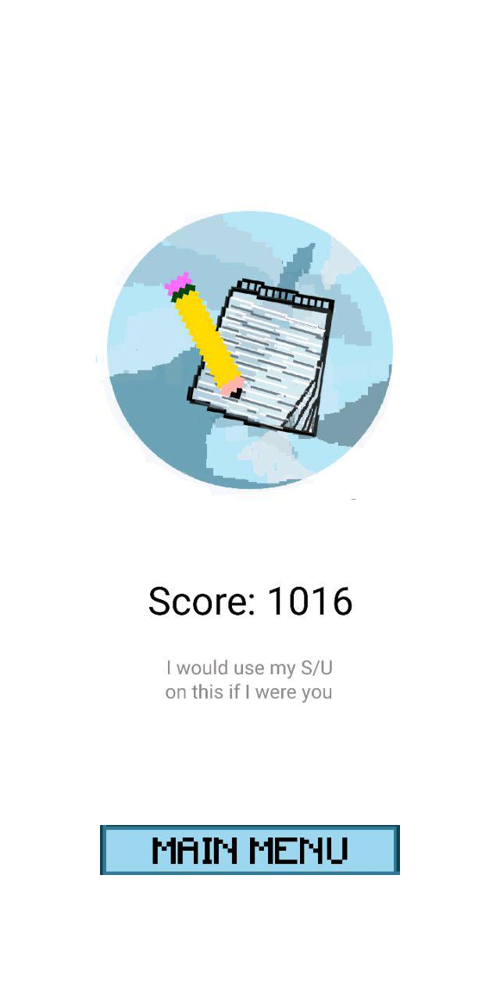

# GroupSketch
GroupSketch is a multiplayer drawing game that was created with Processing during Hack&Roll 2019. 

Contributors:
Chen Yuan Bo
[Oliver Cheok](https://github.com/olivercheok20)
[Larry Law](https://github.com/larrylawl) 
[Wong Wen Wei](https://www.linkedin.com/in/wong-wen-wei/)

### Gameplay

              Menu             |             Instructions              |             Game Settings
:-----------------------------:|:-------------------------------------:|:-------------------------------------:
||

           Observer Screen           |            Drawer Screen             |            Score Page
:-----------------------------------:|:------------------------------------:|:------------------------------:
||

 

### File structure

- Main game logic is located in the file [groupsketch.pde](game_files/groupsketch.pde)
- [Button.pde](game_files/Button.pde) and [CheckboxButton.pde](game_files/CheckboxButton.pde) are button classes that are used within the game application
- "[data](game_files/data/)" contain all the pictures and sprites used in the game.
 

### Processing
According to the [processing](https://processing.org/) website, "Processing is a flexible software sketchbook and a language for learning how to code within the context of the visual arts." It is a fast and simple platform to use in developing small applications with Java. All code was written, tested and debugged on the Processing application.

